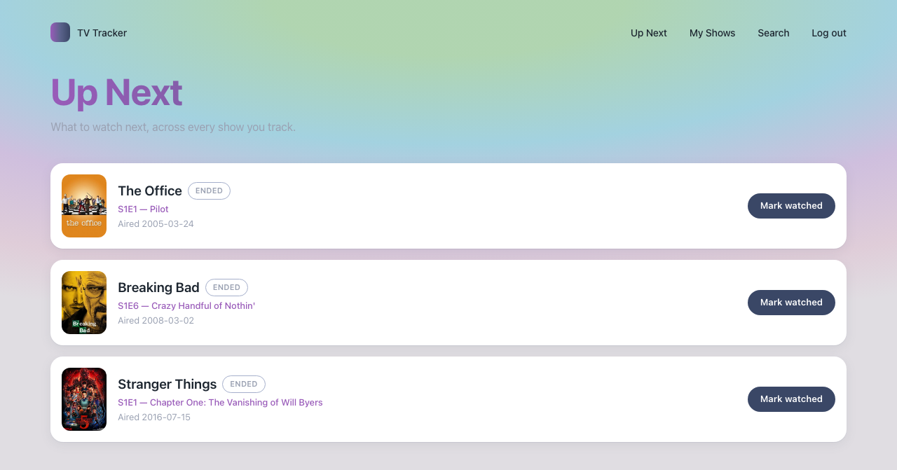
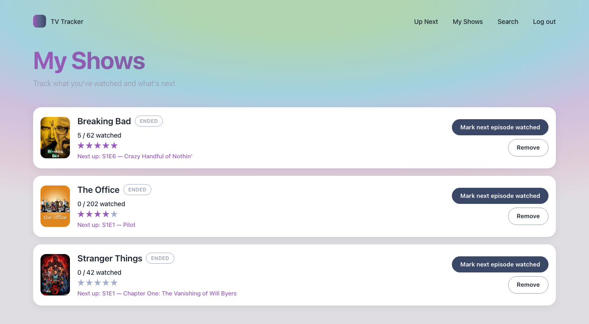
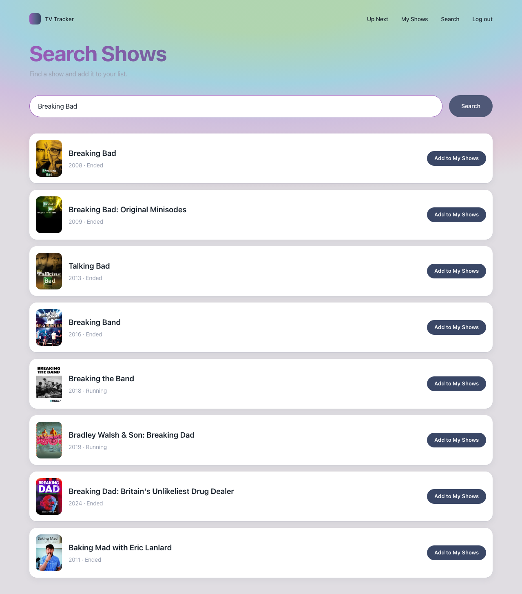
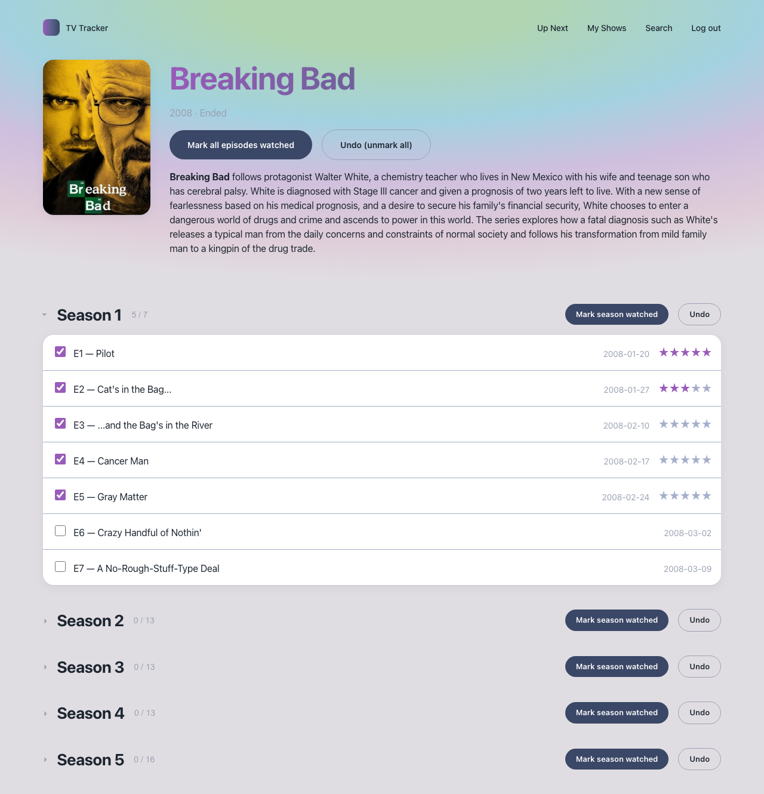

# TV Tracker

TV Tracker is an episode tracker. It works like TV Time.

Use TV Tracker to do these tasks:
- Search for shows.
- Track shows.
- Mark episodes as watched. You can mark one episode or many episodes at the same time.
- View the next episode to watch for each show you track.

## Screenshots

| Up Next | My Shows |
| --- | --- |
|  |  |

| Search | Show detail |
| --- | --- |
|  |  |

<details>
<summary>Login</summary>


</details>

## Architecture

The application has two parts: the backend and the frontend.

```
backend/    FastAPI + SQLite
  app/
    main.py           Start point of the app. Sets up CORS and routers. Provides /health.
    models.py         SQLAlchemy models: User, TrackedShow, WatchedEpisode.
                        TrackedShow and WatchedEpisode each have an optional
                        rating field. The value is 1 to 5. You set each rating
                        independently.
    schemas.py         Pydantic shapes for requests and responses.
    security.py        Hashes passwords with bcrypt. Manages JWT authentication.
    db.py               Sets up the SQLite engine and sessions.
    routers/
      auth.py           Handles register and login.
      shows.py          Handles show search and show detail. Proxies TVMaze.
      tracking.py       Handles track/untrack for shows. Handles mark/unmark
                          for episodes, one at a time or in bulk. Provides
                          "my shows" with next-up data.
    services/
      tvmaze.py          Contains all calls to the TVMaze API.
  tests/                Contains the pytest suite. See Testing below.

frontend/   React + TypeScript + Vite
  src/
    pages/
      AuthPage.tsx        Login and register page.
      UpNextPage.tsx      Home page. Shows the next episode for each tracked show.
      MyShowsPage.tsx     Shows tracked shows and watch progress.
      SearchPage.tsx      Provides live show search.
      ShowDetailPage.tsx  Shows the season and episode list. Provides bulk watch actions.
    components/
      StarRating.tsx      Shared star rating control. Used for episodes and shows.
    api/client.ts        Typed fetch wrapper. Contains one function per endpoint.
    context/AuthContext.tsx
    types.ts
    index.css, App.css   Design system tokens and component styles.
```

TV Tracker does not store show or episode data in its own database. This
data includes titles, images, and air dates. TV Tracker fetches this data
from the [TVMaze API](https://www.tvmaze.com/api) on each request.

The TV Tracker database stores only your tracking state. This state includes
two types of IDs: TVMaze show IDs you added, and TVMaze episode IDs you
watched. This design keeps the data model simple. It also means the data
never goes out of date, because TV Tracker always reads the current TVMaze
catalog.

When you remove a show from "My Shows", TV Tracker deletes only the
`TrackedShow` row for that show. TV Tracker keeps your `WatchedEpisode`
history for that show. If you add the same show again later, TV Tracker
restores your watched progress. Your progress does not restart at zero.

## Features

- **Search** — Type a query. TV Tracker searches TVMaze after a 300ms pause.
  You do not need to press Enter.
- **Track shows** — Add a show to "My Shows". You can add a show from the
  search page or from the show detail page.
- **Up Next** — This is the home page. It shows one row for each tracked
  show. Each row shows the next episode to watch. Rows are sorted by air
  date, soonest first. If a show is fully watched but has a future episode
  scheduled, the row still appears. TV Tracker tags this row "Upcoming".
- **Mark episodes watched** — Use a checkbox to mark one episode. Use
  "Mark season watched" or "Undo" to mark or unmark a full season. You can
  also mark or unmark a full show. TV Tracker updates watch-progress counts
  immediately.
- **Collapsible seasons** — On the show detail page, TV Tracker expands the
  season that contains your next unwatched episode. TV Tracker collapses
  the other seasons. This behavior keeps long shows easy to scroll.
- **Status badges** — TV Tracker shows a status badge for each show, for
  example Running or Ended. This data comes from TVMaze. On the Up Next
  page, TV Tracker also tags episodes that have not aired yet as "Upcoming".
- **Ratings** — You can give a 1-to-5 star rating to any watched episode.
  Rate episodes on the show detail page. You can also give a separate
  1-to-5 star rating to the show itself. Rate shows on the "My Shows" page.
  These two ratings are independent. TV Tracker does not calculate a show
  rating from episode ratings.

## Design system

The user interface follows the design tokens in `plan/DESIGN.md`. This file
is a local design reference. Git does not track this file.

The design uses a light background with an aurora gradient. The design uses
one accent color pairing: magenta and navy. Buttons have a pill shape. Cards
float above the background with a three-layer soft shadow.

The CSS custom properties for these tokens are in `frontend/src/index.css`.
`frontend/src/App.css` uses these properties throughout the application.

## API reference

All `/tracking/*` routes need an `Authorization: Bearer <token>` header. Get
this token from `/auth/login`. The `/shows/*` routes do not need
authentication. These routes proxy TVMaze directly.

| Method | Path | Notes |
| --- | --- | --- |
| POST | `/auth/register` | Send `{email, password}`. Returns 201 and the new user. The response does not include the password. |
| POST | `/auth/login` | Send OAuth2 form fields (`username` and `password`). Returns 200 and a JWT bearer token. |
| GET | `/shows/search?q=` | Searches TVMaze. An empty query returns `[]`. |
| GET | `/shows/{show_id}` | Returns show detail and the full episode list. |
| GET | `/tracking/shows` | Returns "My Shows". Each show includes `next_episode`, `next_unaired_episode`, watch counts, and `rating`. |
| POST | `/tracking/shows` | Tracks a show. Calling this twice for the same show has no extra effect. |
| DELETE | `/tracking/shows/{tvmaze_show_id}` | Untracks a show. |
| PUT | `/tracking/shows/{tvmaze_show_id}/rating` | Sets or updates the rating for a tracked show. Returns 404 if the show is not tracked. |
| POST | `/tracking/episodes` | Marks one episode watched. Calling this twice for the same episode has no extra effect. |
| DELETE | `/tracking/episodes/{tvmaze_episode_id}` | Unmarks one episode. |
| PUT | `/tracking/episodes/{tvmaze_episode_id}/rating` | Sets or updates the rating for a watched episode. Returns 404 if the episode is not watched. |
| POST | `/tracking/episodes/bulk` | Marks many episodes watched at the same time. Already-watched episodes are not affected again. |
| POST | `/tracking/episodes/bulk-unmark` | Unmarks many episodes at the same time. |
| GET | `/tracking/episodes/watched` | Returns all watched episodes for the current user. Each episode includes `rating`. |
| GET | `/health` | Returns `{"status": "ok"}`. |

Start the backend. Then open http://localhost:8000/docs to view the
interactive API docs (Swagger UI).

## Running locally

Open two terminals. Run the backend in one terminal. Run the frontend in
the other terminal.

### Backend

Run these commands:

```bash
cd backend
python3 -m venv .venv
source .venv/bin/activate
pip install -r requirements.txt
uvicorn app.main:app --reload --port 8000
```

On first run, this process creates the file `tv_tracker.db`. This is a
SQLite database file.

### Frontend

Run these commands:

```bash
cd frontend
npm install
npm run dev
```

Open http://localhost:5173 in your browser.

## Testing

The backend has a pytest suite in `backend/tests/`. This suite has 25
tests. The tests cover these areas:

- Auth flows.
- Correctness and idempotency of bulk mark and bulk unmark actions.
- Isolation between different users' data.
- The "my shows" calculation for next episode and next unaired episode.
  These tests use `pytest-mock` to stub TVMaze responses. The tests do not
  send real network requests.
- Validation and storage of episode and show ratings.

Run the tests with these commands:

```bash
cd backend
source .venv/bin/activate
python -m pytest
```

Each test runs against an isolated in-memory SQLite database. The tests
never change the real development database (`tv_tracker.db`).

There is no frontend test suite yet.

## Known limitations

- Authentication is minimal. The JWT secret in `security.py` is a
  hardcoded value for development. This setup works for local use. Do not
  use this setup in production. Before you deploy the app, move the secret
  to an environment variable.
- The `GET /tracking/shows` endpoint fetches the full episode list from
  TVMaze for each tracked show, on every request. TV Tracker does not
  cache this data locally. This process works for a small number of
  tracked shows. This process becomes slow if a user tracks hundreds of
  shows.
- TV Tracker does not have password reset. TV Tracker does not have
  social features. TV Tracker does not have notifications or a calendar
  view. See the open GitHub issues for planned features.
